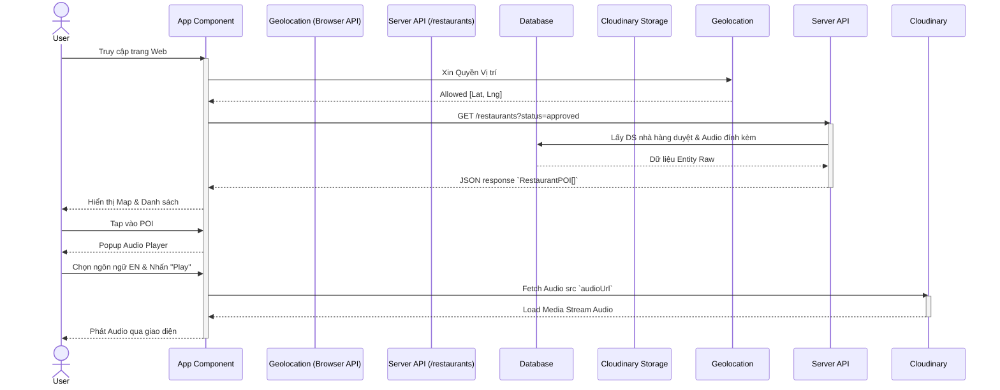

# Product Requirements Document (PRD) v1.0
**Project:** Ứng dụng User - Thuyết minh Phố đi bộ (Food Tour Audio Guide)
**Version:** 1.0 (MVP)

---

## 1. Overview + Goals
**Mục tiêu:** Xây dựng ứng dụng hướng tới người dùng cuối (khách du lịch/người đi bộ) để khám phá các địa điểm thú vị (POI - Point of Interest) như quán ăn, di tích xung quanh phố đi bộ. Thay vì phải đọc văn bản dài, người dùng có thể tra cứu trên bản đồ và nghe thuyết minh đa ngôn ngữ trực tiếp thông qua trình phát Audio.

---

## 2. In-scope / Out-of-scope (MVP)

### In-scope (Phạm vi MVP)
1. **Bản đồ trực quan (Map Module):** Hiển thị màn hình bản đồ với vị trí hiện tại (GPS realtime) của người dùng và đánh dấu định vị các POI.
2. **Danh sách địa điểm (List Module):** Hiển thị danh sách các thẻ (cards) POI ở gần kèm thông tin cơ bản: ảnh, tên, mô tả ngắn gọn.
3. **Thuyết minh Audio (Audio Module):** Phát audio hướng dẫn, hỗ trợ chuyển đổi đa ngôn ngữ từ danh sách các tệp đã được tạo (dữ liệu lấy từ Admin).

### Out-of-scope (Chưa làm trong MVP - Future Enhancements)
- Đăng ký/đăng nhập cho End-user.
- Tính năng đánh giá, bình luận, chấm điểm (Review/Rating) trực tiếp.
- Chỉ đường chi tiết (Turn-by-turn navigation bằng API Google Maps Direction).
- Thanh toán / Đặt món trước tại nhà hàng.

---

## 3. Personas & Roles

*Mặc dù ứng dụng hiện tại chỉ là "User App", hệ sinh thái tổng thể bao gồm 2 vai trò tương tác với dữ liệu:*

| Role | Tên | Mô tả |
| :--- | :--- | :--- |
| **End-User** | Khách du lịch | Người mở app trên điện thoại khi đang đi bộ. Nhu cầu: Tìm kiếm địa điểm ăn uống, nghe thuyết minh đa ngôn ngữ để hiểu về văn hoá. |
| **Admin** | Quản trị viên nội dung | Quản lý và cung cấp nội dung hiển thị cho User App thông qua hệ thống Admin Dashboard (tạo POI, sinh Audio dịch đoạn giới thiệu). |

---

## 4. User Stories (MVP)

| ID | Module | As a... | I want to... | So that I can... |
| :--- | :--- | :--- | :--- | :--- |
| US-01 | Map | End-User | Nhìn thấy vị trí hiện tại của tôi trên bản đồ trực quan | Nhận biết tôi đang đứng ở đâu trên tuyến phố đi bộ. |
| US-02 | Map | End-User | Thấy các điểm ghim biểu thị Quán ăn / POI lân cận | Biết xung quanh có những địa điểm nào đáng chú ý. |
| US-03 | Map/List | End-User | Bấm chọn vào tên một POI trên giao diện | Xem thông tin mô tả chi tiết của địa điểm đó. |
| US-04 | List | End-User | Xem danh sách các POI dưới dạng danh sách cuộn | Chọn lọc và tìm hiểu trước các quán ăn mình sẽ đến. |
| US-05 | Audio | End-User | Bấm nút Play trong bảng thông tin một địa điểm | Nghe thuyết minh giới thiệu nội dung thay vì phải đọc. |
| US-06 | Audio | End-User | Thay đổi tùy chọn ngôn ngữ ở giao diện Audio | Nghe tư liệu bằng ngôn ngữ mẹ đẻ của tôi (ví dụ: English, Tiếng Việt). |

---

## 5. Functional Requirements (FR)

### 5.1. Module Map (Bản đồ & Định vị)
- **FR_MAP_01:** Khởi tạo truy cập `navigator.geolocation` của thiết bị để bắt GPS.
- **FR_MAP_02:** Hiển thị bản đồ với `center` được zoom vào tọa độ GPS hiện tại.
- **FR_MAP_03:** Component map sẽ render Marker cho từng POI lấy từ dữ liệu Server. Marker phải thể hiện bằng icon phân biệt trực quan.
- **FR_MAP_04:** Cho phép chọn/click Marker trên bản đồ để mở Card thông tin thu gọn.

### 5.2. Module List (Danh sách POIs)
- **FR_LST_01:** Hiển thị UI Card View chứa: `Tên`, `Loại ẩm thực`, `Giờ mở cửa`, `Hình ảnh cover` của từng địa điểm.
- **FR_LST_02:** Tính toán khoảng cách (theo công thức Haversine Frontend hoặc Backend response) để render số liệu khoảng cách thực tế so với user.

### 5.3. Module Audio (Trình phát thuyết minh)
- **FR_AUD_01:** Cung cấp thanh điều khiển âm thanh (Play/Pause/Tua/Timeline).
- **FR_AUD_02:** Lọc dữ liệu mảng `audioGuides` để hiển thị trong Dropdown chỉ đưa ra lựa chọn những Ngôn Ngữ đã có sẵn tệp dịch audio cho riêng nhà hàng đó.
- **FR_AUD_03:** Khi thay đổi `value` ngôn ngữ ở select, Audio API phải tạm dừng tệp cũ, tự động đổi nguồn `src` tương ứng và thực hiện autoplay (với độ trễ an toàn) tệp MP3/WAV mới.

---

## 6. Acceptance Criteria (Given-When-Then)

| Nhóm | User Story | Acceptance Criteria |
| :--- | :--- | :--- |
| **Map** | US-01 | **Given** người dùng mở ứng dụng và ấn chấp nhận quyền Location.<br>**When** bản đồ được load.<br>**Then** một icon (Blue Dot) ghim vào tọa độ thật của máy. |
| **Map** | US-02 | **Given** server có 5 POIs mang cờ `approved`.<br>**When** người dùng mở app.<br>**Then** trên map hiện rõ 5 pins vị trí quán ăn. |
| **Audio** | US-05 | **Given** người dùng mở Card thông tin quán ăn B.<br>**When** bấm biểu tượng Play.<br>**Then** âm thanh phát ra loa ngoài, thanh gạt progress bar xanh bắt đầu chạy theo tiến độ. |
| **Audio** | US-06 | **Given** POI có audio 2 bản `vi` (Tiếng Việt) và `en` (English). Đang phát bản `vi`.<br>**When** người dùng chọn `en` từ menu thả xuống.<br>**Then** Audio `vi` dừng ngay lập tức, tệp âm thanh bản `en` load streaming và tự động phát từ mốc đầu tiên (thời gian 0:00). |

---

## 7. Non-functional Requirements
1. **Data Fetching:** Vì kiến trúc Frontend React, dữ liệu cần lấy từ API backend (RESTful GET) ngay trong quy trình React Effect Mounting.
2. **Resource Optimization (Media):** Audio element cần xử lý Lazy-load. Chỉ tải buffering file Cloudinary xuống khi người dùng chủ động mở xem Card chi tiết hoặc ấn nút Play.
3. **Error Handling/Fault Tolerance:**
   - Trình duyệt/người dùng từ chối cấp quyền Location: Yêu cầu sử dụng fallback coordinate hiển thị bản đồ toàn cục không theo dõi vị trí.
   - Thất bại khi load danh sách Backend: UI hiển thị Empty State (Empty List).
4. **Responsive UI:** Tối ưu hóa UI di động (Mobile-first).

---

## 8. Data Requirements (State & Model)

UI User cần một interface DTO thu gọn để parse cấu trúc Server Response (đặc biệt nhấn mạnh vào nested data của Audio):

```typescript
export interface POI {
    id: string;            // VD: "uuid-xy1"
    name: string;          // Tên quán (VD: Phở Hoà)
    specialty: string;     // Lọc thuộc tính cuisine
    hours: string;         // Giờ mở cửa
    rating: number;        // (Mock cho MVP)
    lat: number;           // Vĩ độ GPS
    lng: number;           // Kinh độ GPS
    image: string;         // Cover image gốc
    description: string;   // Dịch vụ / Đoạn giới thiệu
    audioUrl: string;      // (Mock fallback config)
    audioGuides?: {        // Khối Audio Thuyết minh
        language: string;  // Chuẩn ISO quy định
        audioUrl: string;  // Cloudinary Direct URL
    }[];
}
```

---

## 9. API Assumptions
**Giao tiếp Client-Server:** Web UI User chỉ cần duy nhất một Endpoint cốt lõi.
- **Endpoint Request:** `GET /api/restaurants?status=approved`
- **Response Format:** Một danh sách mảng JSON Array chứa thông tin POI, bắt buộc bao gồm đối tượng liên kết `audioGuides` thật nằm bên trong.

---

## 10. Dependencies / Risks
- **Trình duyệt Web (HTTPS/Permissions):** Tính năng theo dõi GPS bắt buộc chạy dưới HTTPS hoặc localhost (Chính sách an toàn Web). Rủi ro fail location nếu không deploy dưới HTTPS.
- **Block Auto-play (Safari/iOS):** Các chính sách bảo mật Audio tự phát có thể gây block DOM nếu đổi ngôn ngữ tự động Play mà không có event explicit touch/tap từ bàn tay người dùng. Phải giả lập fallback loading.

---

## 11. Open Questions / Assumptions
1. Định vị và theo dõi Real-time (Geofencing tab Tracking): Ứng dụng có thể hiện cảnh báo "Đã đến quán ăn, bạn có muốn phát audio?" - *Hỏi:* Bán kính bán kính mặc định cảnh báo POI có phải là khoảng 50 mét hay 10 mét?
2. Sorting POIs: Tab danh sách "List" hiện đang xuất theo dữ liệu gốc DB trả về. *Hỏi:* Liệu có cần có hàm Sort khoảng cách tăng dần (Distance) để quán ăn gần xếp lên trước?

---

## 12. System Modeling

### 12.1 Usecase Diagram
```mermaid
usecaseDiagram
    actor Tourist as End-User
    
    package "User Application (Web PWA)" {
        usecase "View Map & GPS Tracing" as UC1
        usecase "Browse Nearby POIs List" as UC2
        usecase "View POI Detail Card" as UC3
        usecase "Select Audio Language" as UC4
        usecase "Play Translated Audio Guide" as UC5
    }
    
    Tourist --> UC1
    Tourist --> UC2
    Tourist --> UC3
    UC3 ..> UC4 : <<extends>>
    UC4 ..> UC5 : <<includes>>
```

### 12.2 Sequence Diagram

